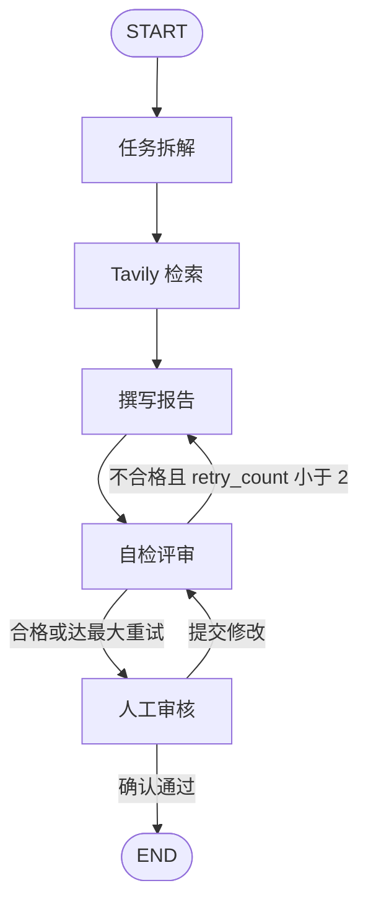

# 业务报告撰写与审核 Agent

面向企业调研 / 业务复盘 / 工作总结场景的 **LangGraph 多智能体工作流**。输入一句话需求后，Agent 自动完成任务拆解、联网检索、结构化写稿、自检返工，并在关键节点接入 **Human-in-the-loop**。提供 CLI 与 Streamlit 双入口。

---

## 1. 项目简介

本项目定位不是「一次性 Chat 写报告」，而是把报告生产做成可编排、可校验、可人工介入、可断点续跑的工程流水线。

**业务场景**

- 输入：调研课题、业务复盘诉求、阶段性工作总结
- 输出：带证据引用的 Markdown 业务报告，自动落盘到 `output/`
- 质检：模型自检不合格则返工撰写（最多 2 次），通过后进入人工确认或在线改稿

**FDE 落地价值**

| 交付关注点 | 本项目对应能力 |
|---|---|
| 流程可编排 | LangGraph `StateGraph` 显式节点 / 条件边，而不是黑盒 AgentExecutor |
| 状态可观测 | `AgentState` 在节点间传递需求、子任务、检索、报告、评审与重试次数 |
| 质量闭环 | `review` 不合格回写 `write_report`，上限后仍交给人 |
| 人机协同 | CLI 终端 HITL / Web 页暂停改稿，决策写回同一套 `human_decision` 路由 |
| 会话可恢复 | `thread_id` + SQLite Checkpoint，中断后按工单号续跑 |
| 双端交付 | 核心图零改动，Streamlit 仅作为轻量 Web 层复用同一套图 |

**模块化工程架构**：LLM、工具、Prompt、节点、条件边、编译、CLI、Web 分层隔离。新增页面不改节点与测试，符合「核心稳、交互可换」的落地交付习惯。

---

## 2. 核心能力清单

- **LangGraph V1 编排**：`START → decompose → search → write_report → review`，条件边驱动返工与人工审核。
- **状态管理**：`TypedDict` 定义 `AgentState` / `AgentStateUpdate`（Partial State），节点只回写增量字段。
- **循环自检**：`review` 解析「结论：合格 / 不合格」；不合格且 `retry_count < 2` 回到撰写节点并累加重试次数。
- **Human-in-the-loop**：CLI 在 `human_review` 内终端确认或改稿；Web 使用 `interrupt_before=["human_review"]` + `update_state(as_node="human_review")`，人改完仍走原条件边（通过结束 / 修改回自检）。
- **Checkpoint 断点**：CLI / Web 共用 `SqliteSaver`（`checkpoints/threads.sqlite`）。`thread_id` 即会话工单号：同一号续跑，换号新开一单。测试侧使用 `InMemorySaver`。
- **工具与模型**：DeepSeek（OpenAI 兼容 `ChatOpenAI`）+ Tavily（单次最多 3 条结果）。
- **可测可演示**：`pytest` 覆盖构图、最多 2 次返工、interrupt 暂停与恢复；Web 分步日志 + Markdown 预览 + 一键下载。

---

## 3. 项目架构

### Agent 流程图

```
用户需求
   │
   ▼
┌──────────┐     ┌──────────┐     ┌──────────────┐
│ decompose│ ──► │  search  │ ──► │ write_report │
│ 任务拆解 │     │ Tavily   │     │ 撰写报告     │
└──────────┘     └──────────┘     └──────┬───────┘
                                         │
                                         ▼
                                  ┌──────────┐
                                  │  review  │ 自检
                                  └────┬─────┘
                     不合格且 retry<2  │
                    ◄─────────────────┘
                                         │ 合格，或已达最大重试
                                         ▼
                                  ┌──────────────┐
                                  │ human_review │
                                  │ 人工确认/改稿 │
                                  └──────┬───────┘
                          修改报告 │         │ 确认通过
                                   ▼         ▼
                                review      END
                                         报告写入 output/
```

Mermaid（GitHub 可直接渲染）：



### 分层说明

| 层 | 职责 |
|---|---|
| `app/config.py` | `.env` → DeepSeek / Tavily / LangSmith |
| `app/llm` · `app/tools` · `app/prompts` | 模型、搜索、提示词，供节点复用 |
| `app/graph/state.py` | 图状态契约 |
| `app/graph/nodes/*` | 五个业务节点，互不编排 |
| `app/graph/edges.py` | 条件路由 |
| `app/graph/builder.py` | 编译图、注入 checkpointer / interrupt |
| `app/main.py` | CLI：stream 日志、SQLite 续跑、报告落盘 |
| `web_app.py` | Streamlit 交付层，只调用现有图与 CLI 辅助函数 |
| `tests/` | 离线 mock，不打真实 API |

---

## 4. 技术栈

| 类别 | 选型 |
|---|---|
| 语言 | Python 3.12+（开发环境验证于 3.14） |
| 编排 | LangGraph ≥ 1.2.11（V1：`StateGraph` / `CompiledStateGraph` / `InMemorySaver`） |
| LLM 应用 | LangChain、langchain-openai |
| 模型 | DeepSeek Chat（OpenAI 兼容协议） |
| 搜索 | Tavily（`langchain-tavily`） |
| 持久化 | langgraph-checkpoint-sqlite |
| 配置 | pydantic-settings、python-dotenv |
| CLI | `python -m app.main` |
| Web | Streamlit（独立安装，不侵入核心依赖） |
| 测试 | pytest |

---

## 5. 环境准备

### 5.1 申请密钥

**DeepSeek API Key**

1. 打开 [DeepSeek 开放平台](https://platform.deepseek.com/)
2. 注册 / 登录后进入 API Keys，创建密钥
3. 复制 `sk-` 开头的 Key，填入 `.env` 的 `DEEPSEEK_API_KEY`
4. 默认 `DEEPSEEK_BASE_URL=https://api.deepseek.com`，模型 `deepseek-chat`

**Tavily API Key**

1. 打开 [Tavily](https://tavily.com/) 注册并进入控制台
2. 创建 API Key（`tvly-` 开头）
3. 填入 `.env` 的 `TAVILY_API_KEY`

密钥只放本机 `.env`，不要提交 Git。仓库已提供 `.env.example`，且 `.gitignore` 忽略 `.env`。

可选：LangSmith 追踪将 `LANGCHAIN_TRACING_V2=true` 并填写 `LANGCHAIN_API_KEY`。演示默认关闭。

### 5.2 安装依赖

Windows PowerShell：

```powershell
cd D:\A_devdev\Projects\business-review-agent
python -m venv .venv
.\.venv\Scripts\Activate.ps1
pip install -r requirements.txt
copy .env.example .env
# 编辑 .env，填入真实 Key
```

macOS / Linux：

```bash
python -m venv .venv
source .venv/bin/activate
pip install -r requirements.txt
cp .env.example .env
```

Web 演示额外安装：

```powershell
pip install streamlit
```

---

## 6. 本地启动运行教程

在项目根目录、已激活虚拟环境的前提下操作。

### CLI

```powershell
# 交互模式（直接回车可使用示例需求）
python -m app.main

# 指定需求
python -m app.main --query "调研2026大模型Agent企业落地方案"

# 指定会话工单号（新建或续跑）
python -m app.main --query "调研2026大模型Agent企业落地方案" --thread-id demo-1

# 仅凭已有 thread_id 恢复断点
python -m app.main --thread-id demo-1
```

终端会按节点打印 state 更新。流程结束（或人工确认后）报告写入 `output/report_{thread_id}_{时间}.md`。人工审核：回车确认；输入新正文并以单独一行 `END` 提交修改。

### 打印图结构

```powershell
python -m app.graph.builder
```

### 测试

```powershell
python -m pytest tests/test_graph.py -v
```

覆盖：图编译、返工最多 2 次、interrupt 暂停与恢复。不调用真实 LLM / 搜索。

---

## 7. 项目目录说明

```
business-review-agent/
├── app/
│   ├── config.py                 # 环境变量配置
│   ├── main.py                   # CLI 入口
│   ├── llm/deepseek.py           # DeepSeek ChatOpenAI 封装
│   ├── tools/tavily_search.py    # Tavily 搜索（max_results=3）
│   ├── prompts/templates.py      # 拆解 / 撰写 / 自检 Prompt
│   └── graph/
│       ├── state.py              # AgentState
│       ├── builder.py            # 编译 StateGraph
│       ├── edges.py              # 条件路由
│       └── nodes/
│           ├── decompose.py      # 任务拆解
│           ├── search.py         # 检索
│           ├── write_report.py   # 撰写（返工时 retry_count+1）
│           ├── review.py         # 自检
│           └── human_review.py   # CLI 人工审核
├── tests/test_graph.py           # pytest
├── web_app.py                    # Streamlit 页面
├── output/                       # 生成的 Markdown 报告（*.md 不入库）
├── checkpoints/                  # SQLite 会话（git 忽略）
├── .env.example                  # 密钥模板
├── requirements.txt
└── README.md
```

`.env`、`.venv/`、`checkpoints/`、`output/*.md` 均不进入版本库。

---

## 8. 前端架构（轻量化 Web 交付层）

`web_app.py` 是 **零侵入交互层**：不修改节点、条件边、测试与 CLI 业务逻辑。

**设计原则**

- **同一张图**：`build_graph(checkpointer=SqliteSaver)`，与 CLI 共用 `checkpoints/threads.sqlite`
- **同一套状态**：仍使用 `human_decision = approve | revise` 驱动原路由
- **Web 专用暂停**：`interrupt_before=["human_review"]`，避免网页进程卡在节点内的 `input()`
- **人审写回**：`graph.update_state(..., as_node="human_review")` 后继续 `stream`，修改则回 `review`，通过则结束
- **复用 CLI 能力**：配置校验、payload 解析、友好错误、`_save_report` 落盘均从 `app.main` 导入

**页面能力**：需求输入、Thread ID 新建/续跑、五步进度条、节点日志实时刷新、暂停时在线改稿或确认、Markdown 渲染、一键下载。

---

## 9. Streamlit 使用教程

### 9.1 启动

```powershell
# 项目根目录、虚拟环境已激活
pip install streamlit
python -m streamlit run web_app.py
```

浏览器打开终端提示的本地地址（一般为 `http://localhost:8501`）。侧边栏应显示 DeepSeek / Tavily 配置已加载；若提示缺密钥，检查 `.env`。

### 9.2 怎么用（把 Thread ID 当成工单号）

1. 在「业务复盘 / 调研需求」中填写课题，或点侧边栏「填入示例需求」。  
   示例：`调研2026大模型Agent企业落地方案`
2. **Thread ID（工单号）**  
   - 留空再点「开始 / 续跑」：系统自动发号，请记下或截图  
   - 「新建会话 ID」：另开一单，不接着上一单  
   - 填历史号：从上次暂停处续跑（例如卡在人工审核）
3. 观察进度：**任务拆解 → 联网搜索 → 报告撰写 → 自检评审 → 人工审核**。自检失败会自动返工撰写，最多 2 次。
4. 暂停后：阅读自检意见，**确认通过** 或 **修改正文并重新自检**。
5. 结束后页面渲染 Markdown，可下载；同时写入 `output/`。

**不要把 Thread ID 理解成登录账号。** 谁持有该号，谁就能续上这一单。内部演示时工单号不要随意转发。

### 9.3 常见问题

| 现象 | 处理 |
|---|---|
| 缺少 DEEPSEEK_API_KEY / TAVILY_API_KEY | 复制 `.env.example` 为 `.env` 并填写 |
| 鉴权失败 / 401 | Key 无效或复制多余空格 |
| 超时、网络错误 | 检查代理与外网访问 DeepSeek / Tavily |
| 空需求无法启动 | 填写需求，或只填已有 Thread ID 做续跑 |
| `ModuleNotFoundError: streamlit` | `pip install streamlit` 后再 `streamlit run web_app.py` |

---

## License

仅供学习、面试作品与内部 PoC 演示。使用 DeepSeek、Tavily 时请遵守各平台服务条款与数据合规要求。
